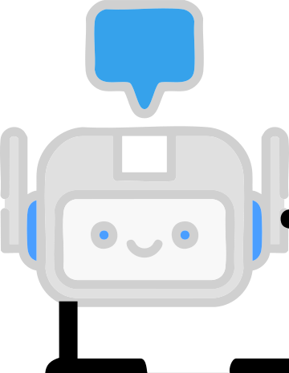

# Mascot Animator - Reusable Animation System

A comprehensive, lightweight JavaScript library for adding animated mascot characters to your applications. Perfect for creating engaging user interfaces with friendly animated guides, loading indicators, notifications, and welcome messages.

## Features

- 🎭 **Multiple Animation Types**: Welcome messages, thinking indicators, loading screens, and notifications
- 🎨 **Fully Customizable**: Colors, positioning, messages, durations, and styles
- 📱 **Responsive Design**: Works seamlessly on desktop and mobile devices
- ♿ **Accessibility**: Supports reduced motion preferences and high contrast modes
- 🎯 **Framework Agnostic**: Pure JavaScript - works with any framework or vanilla HTML
- 🎪 **CSS-Only Option**: Use with existing assets and custom CSS
- 🔧 **TypeScript Ready**: Full type definitions included
- 🎬 **Smooth Animations**: Hardware-accelerated CSS animations with graceful fallbacks

## Quick Start

### Option 1: JavaScript Class (Recommended)

```html
<!DOCTYPE html>
<html>
<head>
    <title>Mascot Demo</title>
</head>
<body>
    <!-- Your content -->
    
    <script src="js/MascotAnimator.js"></script>
    <script>
        // Initialize with your mascot assets
        const mascot = new MascotAnimator({
            assets: {
                animated: 'assets/ae-mascot-animated.gif',
                static: 'assets/ae-mascot.png',
                icon: 'assets/robot-mascot.svg'
            }
        });
        
        // Show a welcome message
        mascot.showWelcome('Welcome to our app!', {
            duration: 3000,
            position: 'bottom-right'
        });
    </script>
</body>
</html>
```

### Option 2: CSS-Only Implementation

```html
<!DOCTYPE html>
<html>
<head>
    <title>CSS Mascot Demo</title>
    <link rel="stylesheet" href="css/mascot-animator.css">
</head>
<body>
    <!-- Your content -->
    
    <!-- Manual mascot notification -->
    <div class="mascot-notification-container position-bottom-right type-success">
        <div class="mascot-notification-content">
            
            <div class="mascot-notification-text">
                <div class="mascot-notification-title">Success!</div>
                <div class="mascot-notification-message">Your action completed successfully.</div>
            </div>
        </div>
    </div>
</body>
</html>
```

## API Reference

### Constructor Options

```javascript
const mascot = new MascotAnimator({
    // Asset paths (required)
    assets: {
        animated: 'path/to/animated.gif',    // For thinking/loading states
        static: 'path/to/static.png',        // For welcome messages
        icon: 'path/to/icon.svg'             // For notifications
    },
    
    // Default configuration (optional)
    defaults: {
        position: 'bottom-right',            // 'bottom-right', 'bottom-left', 'top-right', 'top-left', 'center'
        theme: 'dark',                       // 'dark' or 'light'
        duration: 3000,                      // Default display duration in milliseconds
        enableAnimations: true,              // Enable/disable animations
        className: '',                       // Additional CSS classes
        zIndex: 99999                        // CSS z-index value
    }
});
```

### Methods

#### showWelcome(message, options)
Display a welcome message with static mascot image.

```javascript
mascot.showWelcome('Welcome to our application!', {
    position: 'center',          // Override default position
    duration: 5000,              // Show for 5 seconds
    theme: 'light',              // Use light theme
    callback: () => {            // Optional callback when dismissed
        console.log('Welcome dismissed');
    }
});
```

#### showThinking(message, options)
Show thinking indicator with animated mascot and speech bubble.

```javascript
const thinkingId = mascot.showThinking('Processing your request...', {
    position: 'bottom-right',
    theme: 'dark',
    persistent: true             // Don't auto-dismiss
});

// Dismiss manually when done
setTimeout(() => {
    mascot.dismiss(thinkingId);
}, 3000);
```

#### showLoading(message, options)
Display loading screen with progress bar and animated mascot.

```javascript
const loadingId = mascot.showLoading('Loading your content...', {
    position: 'center',
    showProgress: true,          // Show progress bar
    progress: 0,                 // Initial progress (0-100)
    persistent: true
});

// Update progress
mascot.updateProgress(loadingId, 50);

// Complete loading
mascot.updateProgress(loadingId, 100);
setTimeout(() => {
    mascot.dismiss(loadingId);
}, 500);
```

#### showNotification(title, message, type, options)
Show notification with mascot icon.

```javascript
mascot.showNotification(
    'Success!',                  // Title
    'Your file has been saved successfully.', // Message
    'success',                   // Type: 'success', 'warning', 'error', 'info'
    {
        position: 'top-right',
        duration: 4000,
        dismissible: true        // Show close button
    }
);
```

#### dismiss(id)
Manually dismiss a specific mascot display.

```javascript
const id = mascot.showThinking('Processing...');
// Later...
mascot.dismiss(id);
```

#### dismissAll()
Dismiss all currently displayed mascots.

```javascript
mascot.dismissAll();
```

#### updateProgress(id, progress)
Update progress bar for loading displays.

```javascript
const loadingId = mascot.showLoading('Downloading...', {
    showProgress: true,
    persistent: true
});

// Update progress from 0 to 100
for (let i = 0; i <= 100; i += 10) {
    setTimeout(() => {
        mascot.updateProgress(loadingId, i);
    }, i * 100);
}
```

## Advanced Usage

### Custom Positioning

```javascript
// Use custom positioning with CSS
mascot.showWelcome('Custom positioned message', {
    position: 'custom',
    customCSS: {
        top: '20%',
        left: '30%',
        transform: 'none'
    }
});
```

### Event Callbacks

```javascript
mascot.showNotification('Info', 'Check this out!', 'info', {
    onShow: (element) => {
        console.log('Notification shown', element);
    },
    onDismiss: (element) => {
        console.log('Notification dismissed', element);
    },
    onClick: (element) => {
        console.log('Notification clicked', element);
        // Custom click handling
    }
});
```

### Chaining Animations

```javascript
// Show welcome, then thinking, then success
mascot.showWelcome('Hello! Let me process that for you...', {
    duration: 2000,
    callback: () => {
        const thinkingId = mascot.showThinking('Processing...', {
            persistent: true
        });
        
        setTimeout(() => {
            mascot.dismiss(thinkingId);
            mascot.showNotification('Complete!', 'All done!', 'success');
        }, 3000);
    }
});
```

### Integration with Frameworks

#### React Integration

```jsx
import { useEffect, useRef } from 'react';

function App() {
    const mascotRef = useRef(null);
    
    useEffect(() => {
        // Initialize mascot when component mounts
        mascotRef.current = new MascotAnimator({
            assets: {
                animated: '/assets/mascot-animated.gif',
                static: '/assets/mascot-static.png',
                icon: '/assets/mascot-icon.svg'
            }
        });
        
        // Show welcome message
        mascotRef.current.showWelcome('Welcome to React!');
        
        // Cleanup on unmount
        return () => {
            mascotRef.current?.dismissAll();
        };
    }, []);
    
    const handleAction = async () => {
        const thinking = mascotRef.current.showThinking('Processing...', {
            persistent: true
        });
        
        try {
            await someAsyncOperation();
            mascotRef.current.dismiss(thinking);
            mascotRef.current.showNotification('Success!', 'Operation completed', 'success');
        } catch (error) {
            mascotRef.current.dismiss(thinking);
            mascotRef.current.showNotification('Error!', error.message, 'error');
        }
    };
    
    return (
        <div>
            <button onClick={handleAction}>Do Something</button>
        </div>
    );
}
```

#### Vue.js Integration

```vue
<template>
    <div>
        <button @click="performAction">Click Me</button>
    </div>
</template>

<script>
import MascotAnimator from './js/MascotAnimator.js';

export default {
    data() {
        return {
            mascot: null
        };
    },
    
    mounted() {
        this.mascot = new MascotAnimator({
            assets: {
                animated: '/assets/mascot-animated.gif',
                static: '/assets/mascot-static.png',
                icon: '/assets/mascot-icon.svg'
            }
        });
        
        this.mascot.showWelcome('Welcome to Vue!');
    },
    
    beforeUnmount() {
        this.mascot?.dismissAll();
    },
    
    methods: {
        async performAction() {
            const loading = this.mascot.showLoading('Loading...', {
                showProgress: true,
                persistent: true
            });
            
            // Simulate progress
            for (let i = 0; i <= 100; i += 20) {
                await new Promise(resolve => setTimeout(resolve, 200));
                this.mascot.updateProgress(loading, i);
            }
            
            this.mascot.dismiss(loading);
            this.mascot.showNotification('Done!', 'Action completed', 'success');
        }
    }
};
</script>
```

## CSS Classes Reference

### Container Classes
- `.mascot-welcome-container` - Welcome message container
- `.mascot-thinking-container` - Thinking indicator container
- `.mascot-loading-container` - Loading screen container
- `.mascot-notification-container` - Notification container

### Positioning Classes
- `.position-bottom-right` - Bottom right corner
- `.position-bottom-left` - Bottom left corner
- `.position-top-right` - Top right corner
- `.position-top-left` - Top left corner
- `.position-center` - Center of screen

### Theme Classes
- `.bubble-dark` - Dark theme for speech bubbles
- `.bubble-light` - Light theme for speech bubbles

### Notification Type Classes
- `.type-success` - Success notification styling
- `.type-warning` - Warning notification styling
- `.type-error` - Error notification styling
- `.type-info` - Info notification styling

## Customization

### CSS Custom Properties

You can customize colors and timing using CSS custom properties:

```css
:root {
    --mascot-bg-dark: #2d2d30;
    --mascot-bg-light: #ffffff;
    --mascot-text-dark: #ffffff;
    --mascot-text-light: #333333;
    --mascot-border-dark: #3c3c3c;
    --mascot-border-light: #e0e0e0;
    --mascot-animation-duration: 0.3s;
    --mascot-breathing-duration: 3s;
}
```

### Custom Themes

Create your own theme by extending the CSS:

```css
.mascot-notification-container.theme-custom {
    background: linear-gradient(135deg, #667eea 0%, #764ba2 100%);
    border: 1px solid #8a2be2;
    color: white;
}

.theme-custom .mascot-notification-title {
    color: #fff;
}

.theme-custom .mascot-notification-message {
    color: #e0e0e0;
}
```

```javascript
mascot.showNotification('Custom!', 'This uses a custom theme', 'info', {
    className: 'theme-custom'
});
```

## Accessibility Features

The library includes several accessibility features:

- **Reduced Motion Support**: Respects `prefers-reduced-motion` settings
- **High Contrast Support**: Adapts to `prefers-contrast: high`
- **Keyboard Navigation**: Notifications can be dismissed with Escape key
- **Screen Reader Support**: Proper ARIA labels and semantic markup
- **Focus Management**: Maintains focus flow when dismissing modals

### Accessibility Configuration

```javascript
const mascot = new MascotAnimator({
    assets: { /* ... */ },
    accessibility: {
        respectReducedMotion: true,    // Default: true
        announceToScreenReader: true,  // Default: true
        keyboardDismiss: true,         // Default: true
        focusManagement: true          // Default: true
    }
});
```

## Browser Support

- **Modern Browsers**: Chrome 60+, Firefox 55+, Safari 12+, Edge 79+
- **Mobile**: iOS Safari 12+, Chrome Mobile 60+
- **Legacy Support**: IE 11+ (with polyfills for CSS Grid and backdrop-filter)

### Required Polyfills for Legacy Browsers

```html
<!-- For IE 11 support -->
<script src="https://polyfill.io/v3/polyfill.min.js?features=default,Array.prototype.find,Promise"></script>
```

## Performance Considerations

- **Lightweight**: ~15KB minified (5KB gzipped) for JavaScript + CSS
- **No Dependencies**: Pure vanilla JavaScript
- **Hardware Acceleration**: Uses CSS transforms and opacity for smooth animations
- **Memory Efficient**: Automatic cleanup of dismissed elements
- **Lazy Loading**: Assets only loaded when needed

## Migration Guide

### From v1.x to v2.x

```javascript
// Old way (v1.x)
showMascotWelcome('Hello!', 3000, 'bottom-right');

// New way (v2.x)
mascot.showWelcome('Hello!', {
    duration: 3000,
    position: 'bottom-right'
});
```

## Troubleshooting

### Common Issues

1. **Mascot not showing**: Check that asset paths are correct and accessible
2. **Animations not working**: Verify CSS is loaded and check console for errors
3. **Position issues**: Ensure parent containers don't have conflicting CSS
4. **Performance problems**: Use `dismissAll()` to clean up before showing many mascots

### Debug Mode

```javascript
const mascot = new MascotAnimator({
    assets: { /* ... */ },
    debug: true  // Enables console logging
});
```

## Examples

See the `examples/` folder for complete working examples:

- `basic-usage.html` - Simple implementation examples
- `advanced-features.html` - Complex animations and chaining
- `framework-integration/` - React, Vue, and Angular examples
- `css-only.html` - Pure CSS implementation
- `accessibility-demo.html` - Accessibility features demonstration

## Contributing

Contributions are welcome! Please read our contributing guidelines and submit pull requests to our repository.

## License

MIT License - see LICENSE file for details.

## Credits

- Mascot artwork: Custom animated GIF and SVG assets
- Animation inspiration: Modern UI/UX best practices
- Cross-browser compatibility: Progressive enhancement approach

---

Made with ❤️ for creating delightful user experiences.
